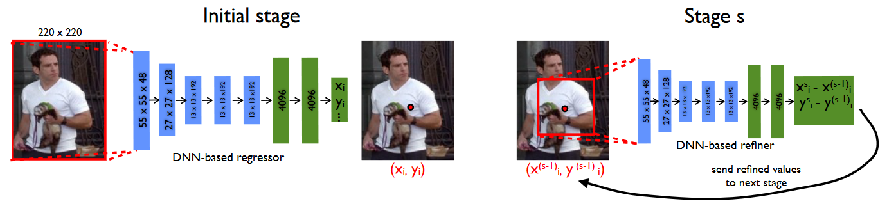
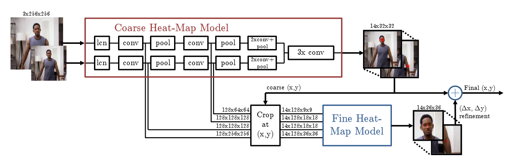
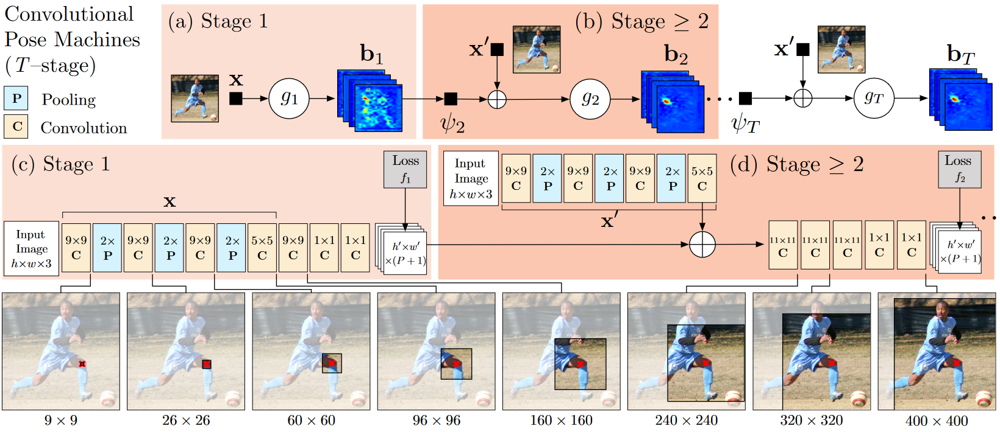
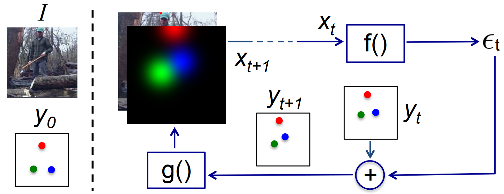
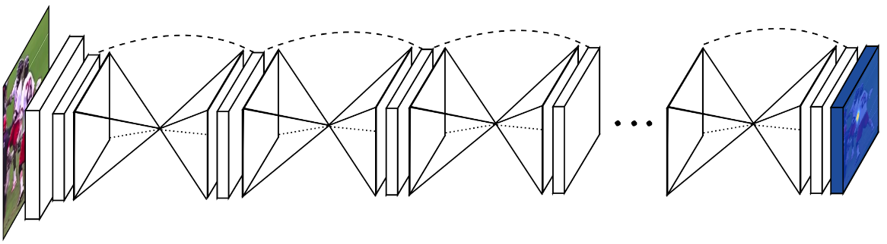
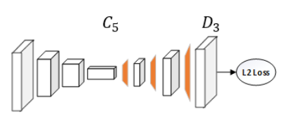
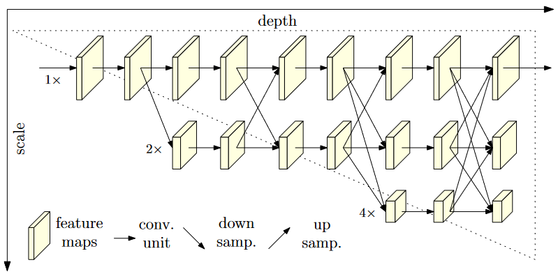

# Human Pose Estimation Methods

## DeepPose: Human Pose Estimation via Deep Neural Networks [arXiv](https://arxiv.org/pdf/1312.4659.pdf)

- First CNN-based model
- Predicts body joints position
- 2 stages - first stage predicts joints position, second stage crops parts of the image around a joint and refine its position

## Efficient Object Localization Using Convolutional Networks [arXiv](https://arxiv.org/pdf/1411.4280.pdf)

- Generates heatmaps
- Heatmap predicts the probability of the joint at each pixel - better than direct regression
- Detection on a variety of image scales
- Model consists of a module for heatmap generation, a module to crop convolution features at joints location, and a module for fine-tuning

## Convolutional Pose Machines [arXiv](https://arxiv.org/pdf/1602.00134.pdf)

- Consists of an image feature computation module followed by a prediction module
- Prediction module can be repeated
- Input for the first module is image and output are heatmaps, input for prediction modules are heatmaps from the previous stage, and original input image

## Human Pose Estimation with Iterative Error Feedback  [arXiv](https://arxiv.org/pdf/1507.06550)

- Model predicts what is wrong with the current estimates and correct them iteratively
- Input for the model is an image and estimated heatmaps from the previous step, output is a correction of joints position

## Stacked Hourglass Networks for Human Pose Estimation [arXiv](https://arxiv.org/pdf/1603.06937.pdf)

- Consist of multiple steps of pooling layers and upsampling layers
- Captures information on multiple scales
- Uses skip connections between downsampling and upsampling layers

## Simple Baselines for Human Pose Estimation and Tracking [arXiv](https://arxiv.org/pdf/1804.06208.pdf)

- Simple and effective
- Consist of a ResNet and deconvolutional layers
- ResNet downsample the image to low resolution, deconvolution upsample feature maps back to high resolution
- No skip connections between ResNet and deconvolution layers

## Deep High-Resolution Representation Learning for Human Pose Estimation  [arXiv](https://arxiv.org/pdf/1902.09212.pdf)

- Maintains a high-resolution and adds parallel subnetworks with lower resolution 
- Parallel branches are connected

## Comparison

|                  |  MPII | COCO |
|------------------|:-----:|:----:|
| DeepPose         | -     |   -  |
| EOL              | 82.0  |   -  |
| CPM              | 87.95 |   -  |
| IEF              | 81.3  |   -  |
| StackedHourglass | 90.9  |   -  |
| Baseline         | 91.5  | 79   |
| HRNet            |   -   | 80.5 |
