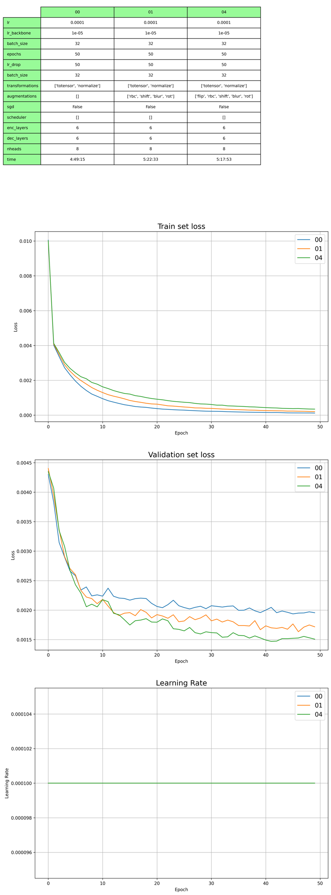
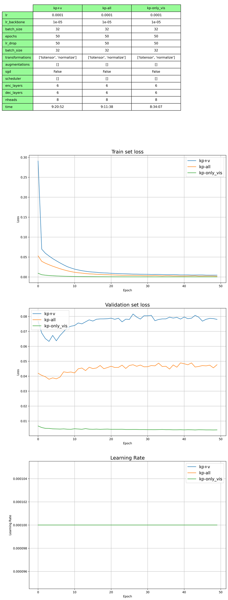
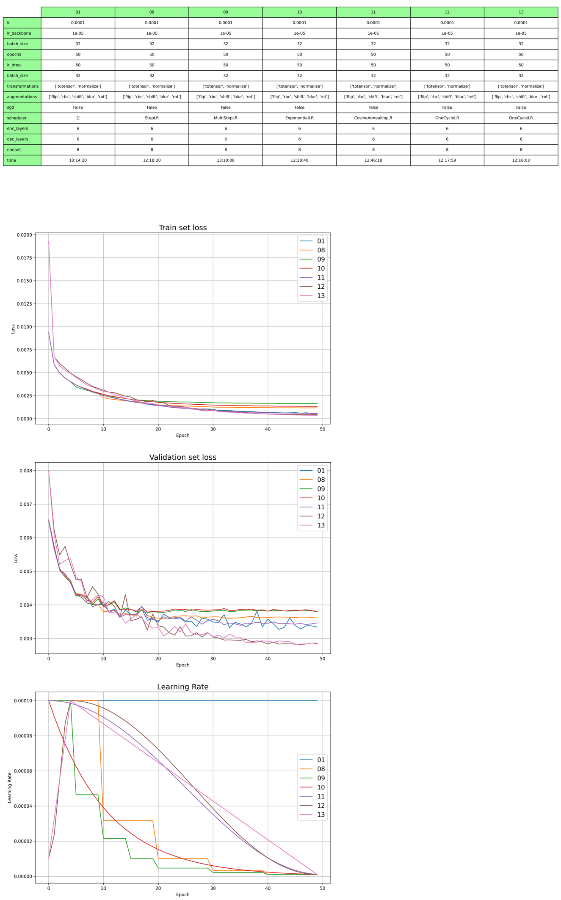
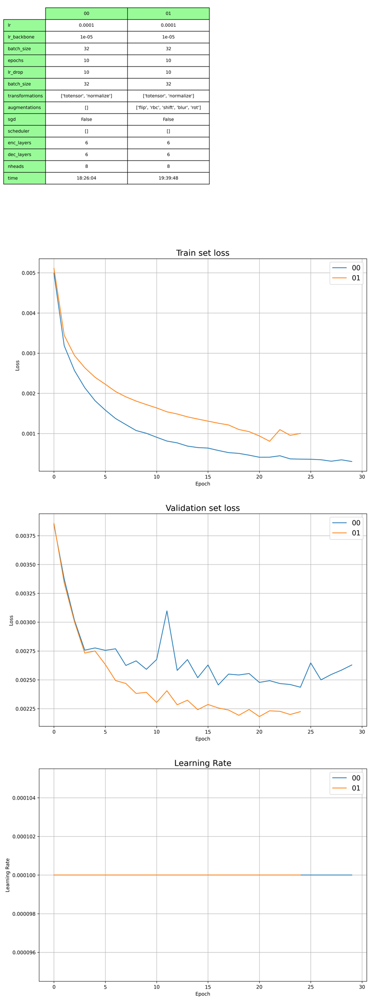

Trénování

|                               | AP    | AP .5 | AP .75 | AP (M) | AP (L) | AR    | AR .5 | AR .75 | AR (M) | AR (L) |
|-------------------------------|-------|-------|--------|--------|--------|-------|-------|--------|--------|--------|
| medium_dataset_00-all_kp      | 0.038 | 0.171 | 0.003  | 0.062  | 0.035  | 0.122 | 0.390 | 0.042  | 0.109  | 0.139  |
| medium_dataset_00-only_vis_kp | 0.131 | 0.413 | 0.047  | 0.141  | 0.140  | 0.254 | 0.615 | 0.176  | 0.239  | 0.276  |

Validace

|                     | AP    | AP .5 | AP .75 | AP (M) | AP (L) | AR    | AR .5 | AR .75 | AR (M) | AR (L) |
|---------------------|-------|-------|--------|--------|--------|-------|-------|--------|--------|--------|
| valset-bb-all-kp    | 0.131 | 0.413 | 0.047  | 0.141  | 0.140  | 0.254 | 0.615 | 0.176  | 0.239  | 0.276  |
| valset-all-kp       | 0.112 | 0.367 | 0.034  | 0.120  | 0.110  | 0.238 | 0.574 | 0.163  | 0.228  | 0.253  |
| valset-only-vis-kp  | 0.112 | 0.366 | 0.033  | 0.141  | 0.095  | 0.238 | 0.574 | 0.163  | 0.227  | 0.253  |

Trénování (x,y,v)

|             | AP    | AP .5 | AP .75 | AP (M) | AP (L) | AR    | AR .5 | AR .75 | AR (M) | AR (L) |
|-------------|-------|-------|--------|--------|--------|-------|-------|--------|--------|--------|
| 00-kp+v     | 0.043 | 0.190 | 0.004  | 0.058  | 0.042  | 0.137 | 0.428 | 0.055  | 0.130  | 0.148  |
| 00-all_kp   | 0.038 | 0.171 | 0.003  | 0.062  | 0.035  | 0.122 | 0.390 | 0.042  | 0.109  | 0.139  |

|                           | AP    | AP .5 | AP .75 | AP (M) | AP (L) | AR    | AR .5 | AR .75 | AR (M) | AR (L) |
|---------------------------|-------|-------|--------|--------|--------|-------|-------|--------|--------|--------|
| 01 | 0.197 | 0.520 | 0.104  | 0.208  | 0.209  | 0.330 | 0.694 | 0.278  | 0.310  | 0.358  |
| 08 | 0.162 | 0.466 | 0.072  | 0.177  | 0.168  | 0.295 | 0.657 | 0.231  | 0.280  | 0.316  |
| 09 | 0.139 | 0.429 | 0.054  | 0.154  | 0.143  | 0.268 | 0.624 | 0.197  | 0.256  | 0.285  |
| 10 | 0.140 | 0.430 | 0.056  | 0.156  | 0.144  | 0.271 | 0.630 | 0.199  | 0.258  | 0.290  |
| 11 | 0.190 | 0.505 | 0.103  | 0.204  | 0.200  | 0.328 | 0.684 | 0.277  | 0.309  | 0.354  |
| 12 | 0.290 | 0.618 | 0.236  | 0.300  | 0.311  | 0.439 | 0.769 | 0.438  | 0.414  | 0.474  |
| 13 | 0.298 | 0.628 | 0.246  | 0.306  | 0.320  | 0.447 | 0.776 | 0.445  | 0.420  | 0.484  |

|  epoch 19         | AP    | AP .5 | AP .75 | AP (M) | AP (L) | AR    | AR .5 | AR .75 | AR (M) | AR (L) |
|---------------------------|-------|-------|--------|--------|--------|-------|-------|--------|--------|--------|
| full_dataset_00   | 0.350 | 0.699 | 0.310  | 0.348  | 0.383  | 0.484 | 0.820 | 0.507  | 0.447  | 0.536  |
| full_dataset_01   | 0.346 | 0.714 | 0.306  | 0.345  | 0.376  | 0.473 | 0.824 | 0.497  | 0.440  | 0.520  |

