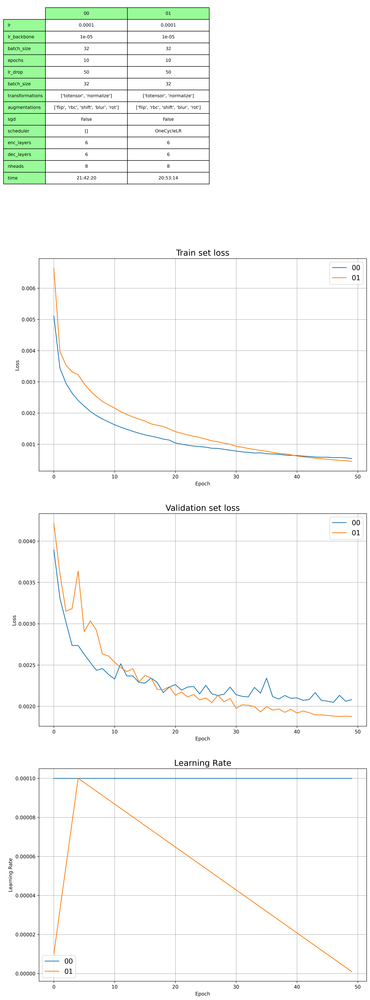
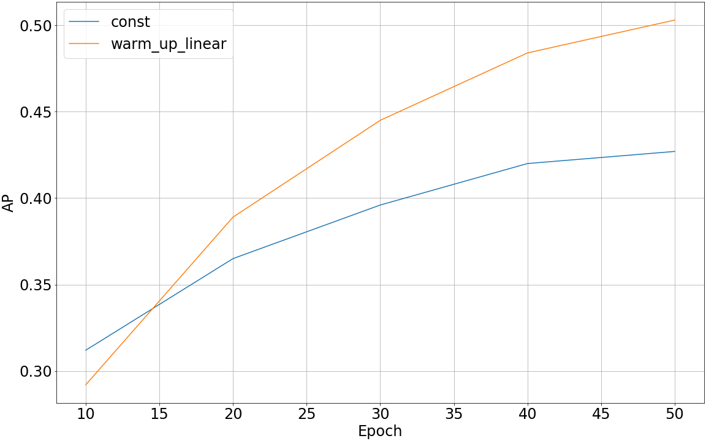
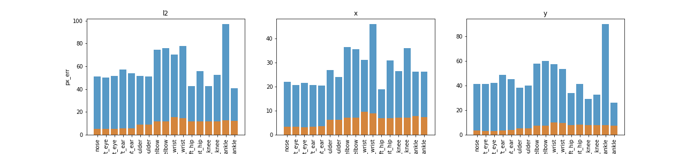
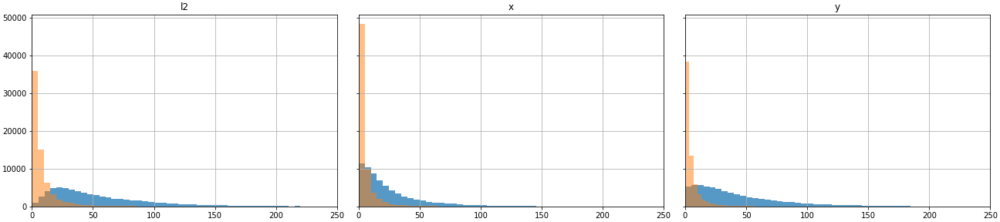
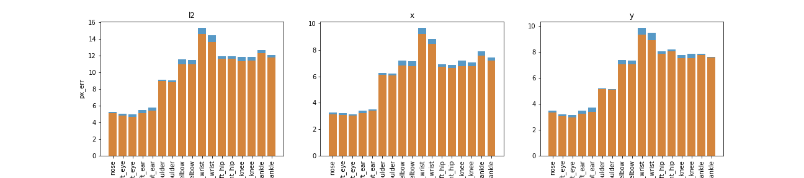
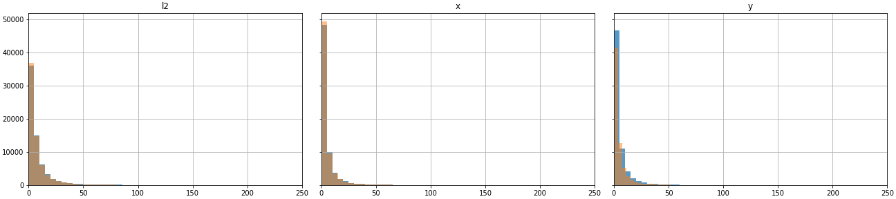

|                      |                      |
|----------------------|----------------------|
|   |  | 
|   |  |
|   |  |

### Full dataset

### Epoch 50 AP results
|                          | AP    | AP .5 | AP .75 | AP (M) | AP (L) | AR    | AR .5 | AR .75 | AR (M) | AR (L) |
|--------------------------|-------|-------|--------|--------|--------|-------|-------|--------|--------|--------|
| full_dataset_const       | 0.427 | 0.752 | 0.448  | 0.424  | 0.462  | 0.557 | 0.852 | 0.617  | 0.520  | 0.610  |
| full_dataset_warm_up-lin | 0.503 | 0.784 | 0.552  | 0.496  | 0.547  | 0.632 | 0.877 | 0.696  | 0.595  | 0.685  |

### Epoch 30 vs. 40 average pixel error

### Epoch 40 vs. 50 average pixel error

