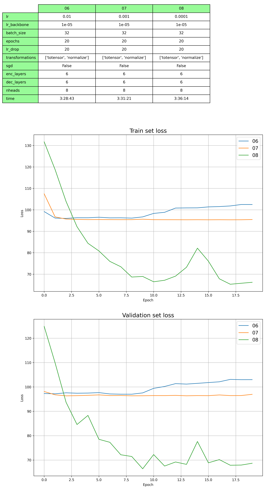
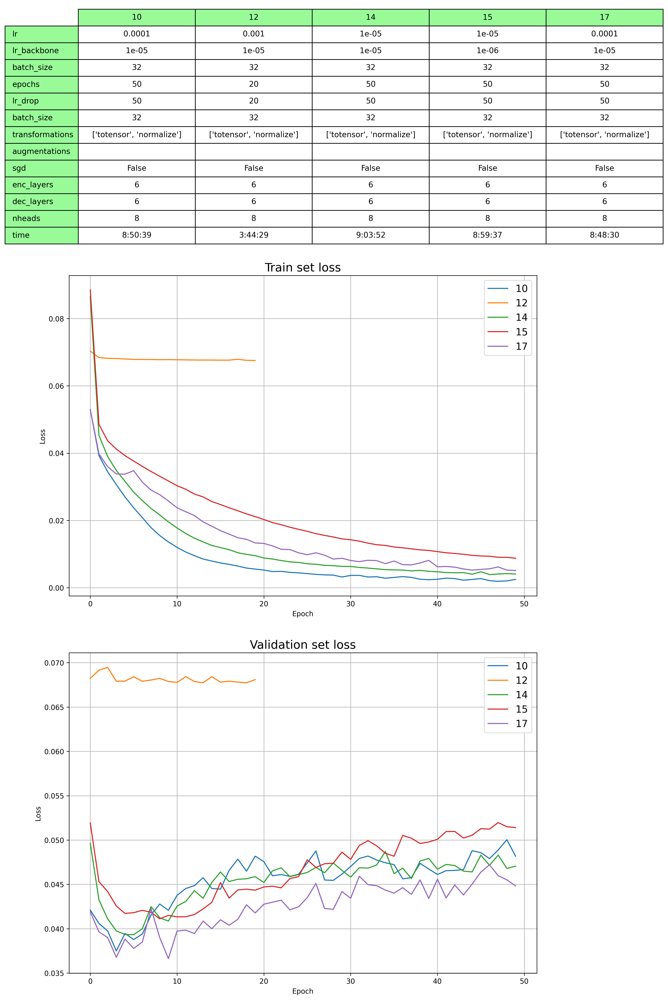
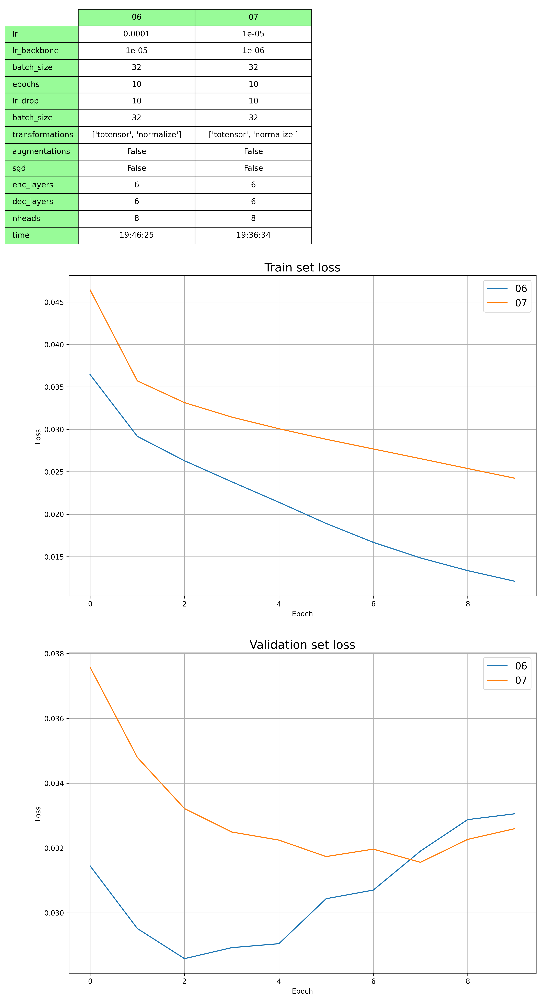

## Medium dataset

- ### 06, 07, 08 - 
  - různé konstanty učení
  - absolutní souřadníce bodů
  - zvýšení batch size z 2 na 32

- ### 10, 12, 14, 15, 17
  - relativní souřadnice bodů
  - 12 vs 17
    - 12 trénováno s konstantou učení 0.001
    - 17 začíná s konstantou učení 0.0001, která během 5 epoch roste na 0.001, poté zůstává konstantní

## Full dataset

**val-set**

| Full dataset 6 | AP    | AP .5 | AP .75 | AP (M) | AP (L) | AR    | AR .5 | AR .75 | AR (M) | AR (L) |
|----------------|-------|-------|--------|--------|--------|-------|-------|--------|--------|--------|
|                | 0.088 | 0.327 | 0.017  | 0.115  | 0.087  | 0.197 | 0.537 | 0.104  | 0.181  | 0.209  |

