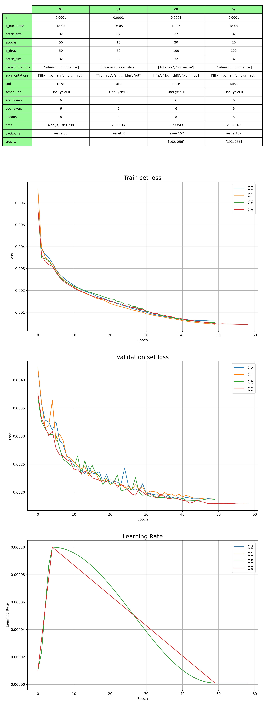
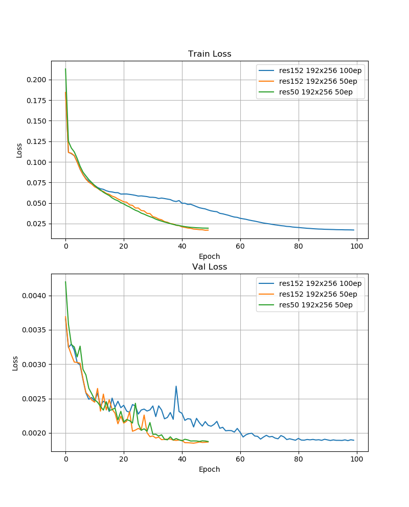
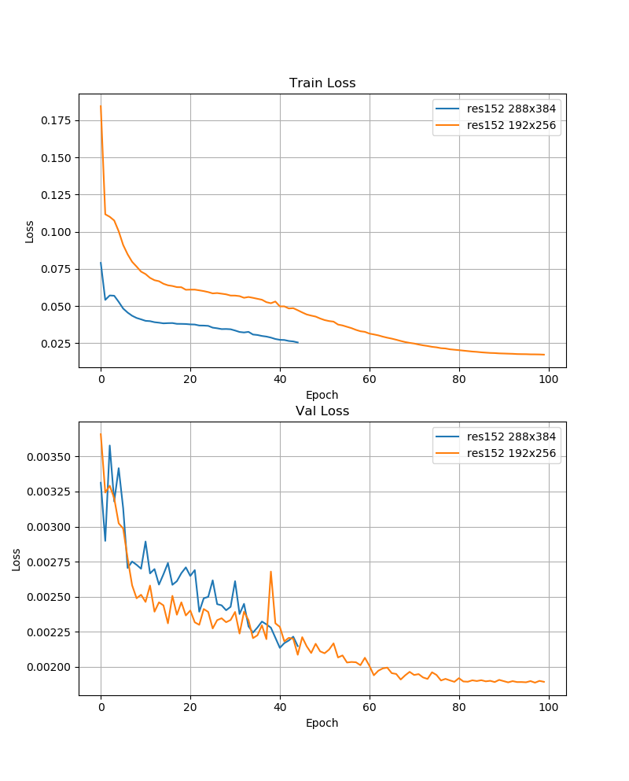
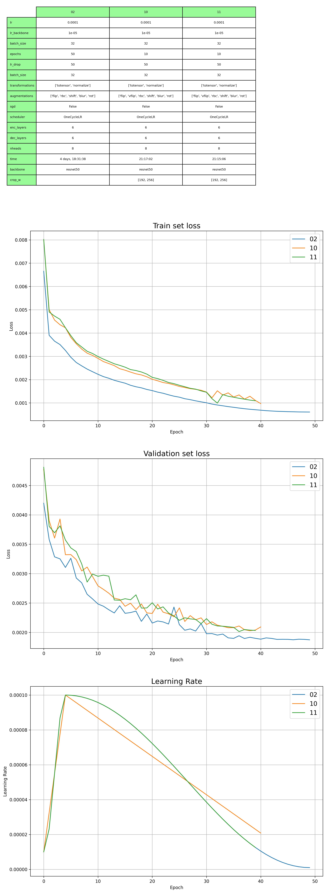
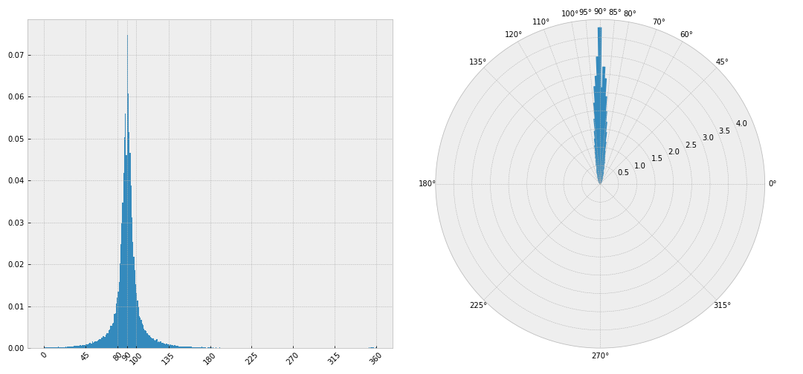
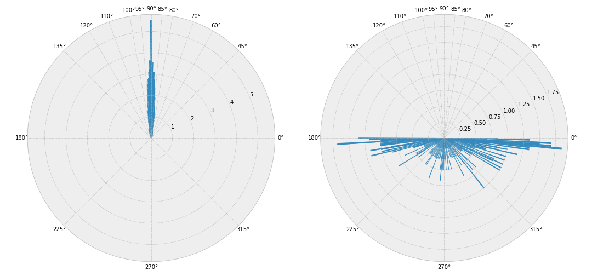

## ResNet 50 vs 152 (50 epoch)

|            | AP    | AP .5 | AP .75 | AP (M) | AP (L) | AR    | AR .5 | AR .75 | AR (M) | AR (L) |
|------------|-------|-------|--------|--------|--------|-------|-------|--------|--------|--------|
| res50 cos  | 0.494 | 0.777 | 0.542  | 0.485  | 0.539  | 0.623 | 0.872 | 0.688  | 0.586  | 0.676  |
| res50 lin  | 0.503 | 0.784 | 0.552  | 0.496  | 0.547  | 0.632 | 0.877 | 0.696  | 0.595  | 0.685  |
| res152 cos | 0.494 | 0.778 | 0.536  | 0.487  | 0.538  | 0.626 | 0.873 | 0.690  | 0.590  | 0.678  |
| res152 lin | 0.509 | 0.789 | 0.561  | 0.499  | 0.555  | 0.637 | 0.880 | 0.704  | 0.600  | 0.689  |

## ResNet 152 (100 epoch)

|                  | AP    | AP .5 | AP .75 | AP (M) | AP (L) | AR    | AR .5 | AR .75 | AR (M) | AR (L) |
|------------------|-------|-------|--------|--------|--------|-------|-------|--------|--------|--------|
| res152 cos 50ep  | 0.494 | 0.778 | 0.536  | 0.487  | 0.538  | 0.626 | 0.873 | 0.690  | 0.590  | 0.678  |
| res152 cos 100ep | 0.501 | 0.771 | 0.553  | 0.495  | 0.544  | 0.632 | 0.870 | 0.699  | 0.596  | 0.684  |
| res50 cos 50ep   | 0.494 | 0.777 | 0.542  | 0.485  | 0.539  | 0.623 | 0.872 | 0.688  | 0.586  | 0.676  |
| res50 cos 100ep  | 0.519 | 0.785 | 0.574  | 0.505  | 0.570  | 0.647 | 0.877 | 0.713  | 0.606  | 0.706  |

## Orientation

	