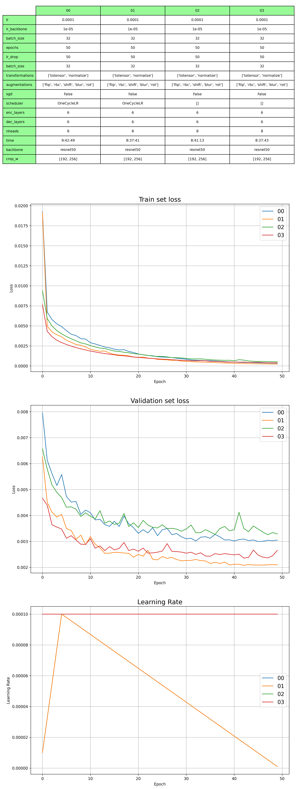
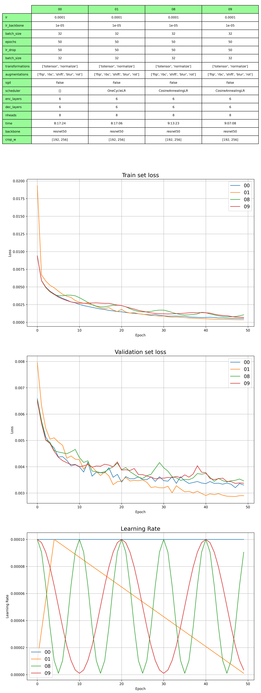

## Medium dataset relative positions

	rel - [w/W, h/H]
	rel2 - [w/max(W,H), h/max(W,H)]

|             | AP    | AP .5 | AP .75 | AP (M) | AP (L) | AR    | AR .5 | AR .75 | AR (M) | AR (L) |
|-------------|-------|-------|--------|--------|--------|-------|-------|--------|--------|--------|
| 00 lin rel     | 0.300 | 0.630 | 0.251  | 0.308  | 0.322  | 0.448 | 0.775 | 0.450  | 0.422  | 0.485  |
| 01 lin rel2    | 0.294 | 0.626 | 0.242  | 0.300  | 0.318  | 0.439 | 0.772 | 0.437  | 0.412  | 0.477  |
| 02 const rel   | 0.199 | 0.519 | 0.104  | 0.207  | 0.213  | 0.333 | 0.695 | 0.280  | 0.311  | 0.364  |
| 03 const rel2 | 0.145 | 0.448 | 0.048  | 0.156  | 0.153  | 0.268 | 0.641 | 0.183  | 0.249  | 0.294  |

## Medium dataset (CyclicLR, CosineAnnealingLR)

### CyclicLR

|          | AP    | AP .5 | AP .75 | AP (M) | AP (L) | AR    | AR .5 | AR .75 | AR (M) | AR (L) |
|----------|-------|-------|--------|--------|--------|-------|-------|--------|--------|--------|
| 00 const | 0.191 | 0.516 | 0.095  | 0.202  | 0.203  | 0.325 | 0.692 | 0.267  | 0.303  | 0.354  |
| 01 lin   | 0.300 | 0.633 | 0.248  | 0.309  | 0.322  | 0.448 | 0.780 | 0.449  | 0.421  | 0.486  |
| 02 cyc   | 0.288 | 0.615 | 0.231  | 0.292  | 0.311  | 0.433 | 0.766 | 0.428  | 0.407  | 0.470  |
| 03 cyc   | 0.251 | 0.586 | 0.178  | 0.265  | 0.264  | 0.398 | 0.744 | 0.377  | 0.378  | 0.426  |
| 04 cyc   | 0.279 | 0.611 | 0.224  | 0.287  | 0.299  | 0.424 | 0.761 | 0.422  | 0.401  | 0.457  |

### CosineAnnealingLR

|          | AP    | AP .5 | AP .75 | AP (M) | AP (L) | AR    | AR .5 | AR .75 | AR (M) | AR (L) |
|----------|-------|-------|--------|--------|--------|-------|-------|--------|--------|--------|
| 00 const | 0.191 | 0.516 | 0.095  | 0.202  | 0.203  | 0.325 | 0.692 | 0.267  | 0.303  | 0.354  |
| 01 lin   | 0.300 | 0.633 | 0.248  | 0.309  | 0.322  | 0.448 | 0.780 | 0.449  | 0.421  | 0.486  |
| 08 cosAn | 0.181 | 0.497 | 0.092  | 0.195  | 0.190  | 0.316 | 0.680 | 0.258  | 0.298  | 0.341  |
| 09 cosAn | 0.190 | 0.505 | 0.102  | 0.203  | 0.199  | 0.327 | 0.685 | 0.274  | 0.308  | 0.352  |

