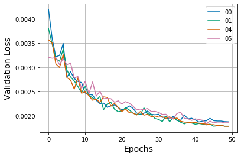
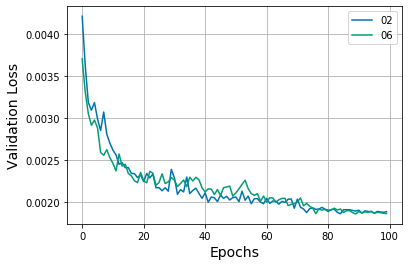
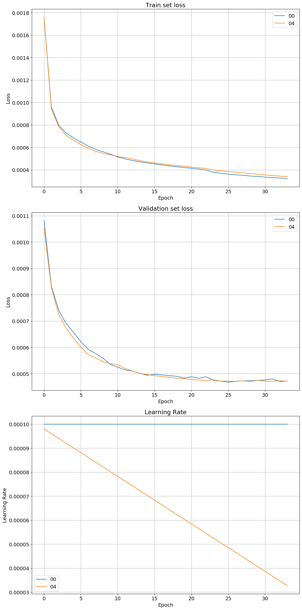
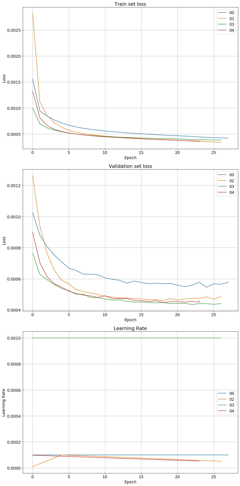

## DePOTR

|     | **resnet** | **epoch** | **image size** | **best val 1** | **best train 1** | **best val 2** | **best train 2** |
|:----|:-----------| :-------- | :------------- | :----------- |:---------------|:---------------|:-----------------|
| 00  | 50         | 50        | S              | 0\.503       | 0\.503         | **0\.496**     | 0\.496           |
| 01  | 50         | 50        | L              | **0\.509**   | 0\.507         | 0\.502         | **0\.506**       |
| 02  | 50         | 100       | S              | 0\.520       | **0\.521**     | 0\.518         | **0\.521**       |  
| 03  | 50         | 100       | L              |              |                |                |                  |
| 04  | 152        | 50        | S              |              |                | **0\.504**     | 0\.502           |  
| 05  | 152        | 50        | L              | **0\.469**   | 0\.466         | 0\.481         | **0\.491**       |  
| 06  | 152        | 100       | S              | **0\.502**   | 0\.501         | **0\.513**     | 0\.513           |
| 07  | 152        | 100       | L              | **0\.492**   | 0\.492         |                |                  | 

|               |                |
|---------------|----------------|
|  |  |

## DePOTR + heatmaps

https://github.com/mhruz/POTR/blob/eca36197397daea99e0b4bfd47a83c101c4b6789/deformable_potr/models/deformable_potr.py#L161

| epoch         | 10     | 20    | 30    |
|---------------|--------|-------|-------|
| model 00 [AP] | 0.456  | 0.517 | 0.548 |
| model 04 [AP] | 0.448  | 0.511 | 0.523 |

## DePOTR + heatmaps + concatenation

| epoch     | 10     | 20    |  
|-----------|-------|-------|
| model 00  | 0.430 | 0.509 | 
| model 02  | 0.530 | 0.581 | 
| model 03  | 0.525 | 0.562 | 
| model 04  | 0.537 |       |

