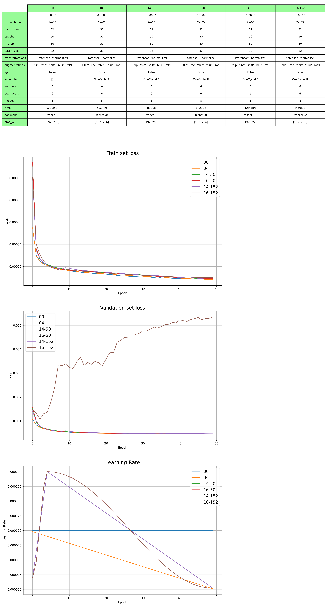

## DePOTR

|        | backbone     | epoch   | image size  | no flip   | flip      |
|--------|--------------|---------|-------------|-----------|-----------|
| 00     | ResNet50     | 50      | 256x192     | 0.496     | 0.513     |
| 01     | ResNet50     | 50      | 384x288     | 0.506     | 0.527     |
| **02** | **ResNet50** | **100** | **256x192** | **0.521** | **0.538** |
| 03     | ResNet50     | 100     | 384x288     | 0.507     | 0.527     |
| 04     | ResNet152    | 50      | 256x192     | 0.504     | 0.520     |
| 05     | ResNet152    | 50      | 384x288     | 0.491     | 0.514     |
| 06     | ResNet152    | 100     | 256x192     | 0.513     | 0.527     |
| 07     | ResNet152    | 100     | 384x288     | 0.496     | 0.516     |

#### test results

|            | AP    | AP .5 | AP .75 | AP (M) | AP (L) | AR    | AR .5 | AR .75 | AR (M) | AR (L) |
|------------|-------|-------|--------|--------|--------|-------|-------|--------|--------|--------|
| no flip    | 0.539 | 0.833 | 0.589  | 0.526  | 0.583  | 0.651 | 0.901 | 0.713  | 0.615  | 0.701  |
|   flip     | 0.557 | 0.838 | 0.614  | 0.541  | 0.605  | 0.665 | 0.902 | 0.728  | 0.628  | 0.716  |

## DePOTR + heatmaps

|            | AP    | AP .5 | AP .75 | AP (M) | AP (L) | AR    | AR .5 | AR .75 | AR (M) | AR (L) |
|------------|-------|-------|--------|--------|--------|-------|-------|--------|--------|--------|
| 00_const   | 0.554 | 0.825 | 0.615  | 0.535  | 0.607  | 0.640 | 0.886 | 0.706  | 0.602  | 0.693  |
| 04_lin     | 0.522 | 0.815 | 0.591  | 0.500  | 0.583  | 0.624 | 0.884 | 0.709  | 0.586  | 0.679  |
| 14_lin     | 0.545 | 0.817 | 0.606  | 0.522  | 0.603  | 0.639 | 0.882 | 0.709  | 0.603  | 0.691  |
| 16_cos     | 0.568 | 0.827 | 0.630  | 0.548  | 0.617  | 0.639 | 0.883 | 0.702  | 0.603  | 0.688  |
| 14-L_lin   | 0.610 | 0.847 | 0.677  | 0.586  | 0.668  | 0.680 | 0.899 | 0.742  | 0.640  | 0.736  |
| 16-L_cos   | 0.570 | 0.820 | 0.630  | 0.545  | 0.635  | 0.670 | 0.888 | 0.734  | 0.631  | 0.725  |
| 14-152_lin | 0.521 | 0.799 | 0.571  | 0.500  | 0.579  | 0.627 | 0.874 | 0.687  | 0.593  | 0.675  |
| 16-152_cos | 0.592 | 0.833 | 0.669  | 0.580  | 0.639  | 0.669 | 0.894 | 0.742  | 0.635  | 0.718  |

#### flip test

|            | AP    | AP .5 | AP .75 | AP (M) | AP (L) | AR    | AR .5 | AR .75 | AR (M) | AR (L) |
|------------|-------|-------|--------|--------|--------|-------|-------|--------|--------|--------|
| 00_const   | 0.589 | 0.838 | 0.657  | 0.567  | 0.642  | 0.657 | 0.890 | 0.724  | 0.622  | 0.707  |
| 04_lin     | 0.561 | 0.837 | 0.644  | 0.536  | 0.621  | 0.641 | 0.894 | 0.726  | 0.603  | 0.696  |
| 14_lin     | 0.561 | 0.823 | 0.624  | 0.541  | 0.619  | 0.655 | 0.889 | 0.724  | 0.621  | 0.704  |
| 16_cos     | 0.587 | 0.837 | 0.648  | 0.568  | 0.637  | 0.654 | 0.888 | 0.713  | 0.621  | 0.701  |
| 14-L_lin   | 0.633 | 0.855 | 0.703  | 0.610  | 0.688  | 0.696 | 0.904 | 0.762  | 0.660  | 0.747  |
| 16-L_cos   | 0.608 | 0.839 | 0.675  | 0.581  | 0.673  | 0.690 | 0.898 | 0.754  | 0.652  | 0.743  |
| 14-152_lin | 0.550 | 0.809 | 0.606  | 0.527  | 0.609  | 0.645 | 0.880 | 0.704  | 0.613  | 0.693  |
| 16-152_cos | 0.613 | 0.842 | 0.685  | 0.600  | 0.663  | 0.686 | 0.901 | 0.753  | 0.654  | 0.732  |

## DePOTR + heatmaps + concatenation

|            | AP    | AP .5 | AP .75 | AP (M) | AP (L) | AR    | AR .5 | AR .75 | AR (M) | AR (L) |
|------------|-------|-------|--------|--------|--------|-------|-------|--------|--------|--------|
| 00_const   | 0.554 | 0.810 | 0.610  | 0.529  | 0.612  | 0.634 | 0.871 | 0.693  | 0.596  | 0.688  |
| 02_lin     | 0.610 | 0.840 | 0.673  | 0.585  | 0.670  | 0.684 | 0.896 | 0.748  | 0.643  | 0.742  |
| 03_const   | 0.581 | 0.831 | 0.629  | 0.550  | 0.644  | 0.653 | 0.884 | 0.705  | 0.609  | 0.716  |
| 04_lin     | 0.589 | 0.830 | 0.655  | 0.557  | 0.660  | 0.679 | 0.891 | 0.747  | 0.636  | 0.739  |

#### flip test

|           | AP    | AP .5 | AP .75 | AP (M) | AP (L) | AR    | AR .5 | AR .75 | AR (M) | AR (L) |
|-----------|-------|-------|--------|--------|--------|-------|-------|--------|--------|--------|
| 00_const  | 0.581 | 0.823 | 0.643  | 0.559  | 0.636  | 0.647 | 0.875 | 0.709  | 0.611  | 0.699  |
| 02_lin    | 0.631 | 0.849 | 0.699  | 0.605  | 0.690  | 0.697 | 0.899 | 0.762  | 0.657  | 0.753  |
| 03_const  | 0.601 | 0.838 | 0.655  | 0.570  | 0.665  | 0.669 | 0.888 | 0.723  | 0.624  | 0.732  |
| 04_lin    | 0.625 | 0.847 | 0.696  | 0.597  | 0.686  | 0.692 | 0.897 | 0.761  | 0.654  | 0.747  |

### 1x1x17 convolution in skip connection 

|            | AP    | AP .5 | AP .75 | AP (M) | AP (L) | AR    | AR .5 | AR .75 | AR (M) | AR (L) |
|------------|-------|-------|--------|--------|--------|-------|-------|--------|--------|--------|
| 00_const   | 0.575 | 0.830 | 0.638  | 0.550  | 0.635  | 0.649 | 0.888 | 0.714  | 0.607  | 0.709  |
| 03_const   | 0.575 | 0.829 | 0.628  | 0.544  | 0.639  | 0.649 | 0.882 | 0.705  | 0.601  | 0.717  |
| 04_lin     | 0.572 | 0.816 | 0.633  | 0.544  | 0.640  | 0.668 | 0.884 | 0.729  | 0.627  | 0.725  |
| 06_lin     | 0.512 | 0.795 | 0.564  | 0.484  | 0.571  | 0.584 | 0.851 | 0.643  | 0.541  | 0.644  |

#### flip test

|            | AP    | AP .5 | AP .75 | AP (M) | AP (L) | AR    | AR .5 | AR .75 | AR (M) | AR (L) |
|------------|-------|-------|--------|--------|--------|-------|-------|--------|--------|--------|
| 00_const   | 0.596 | 0.841 | 0.663  | 0.570  | 0.656  | 0.665 | 0.895 | 0.733  | 0.625  | 0.721  |
| 03_const   | 0.596 | 0.837 | 0.655  | 0.566  | 0.660  | 0.664 | 0.885 | 0.725  | 0.619  | 0.727  |
| 04_lin     | 0.606 | 0.831 | 0.674  | 0.580  | 0.670  | 0.681 | 0.887 | 0.745  | 0.643  | 0.736  |
| 06_lin     | 0.528 | 0.807 | 0.587  | 0.498  | 0.587  | 0.594 | 0.856 | 0.657  | 0.553  | 0.652  |

