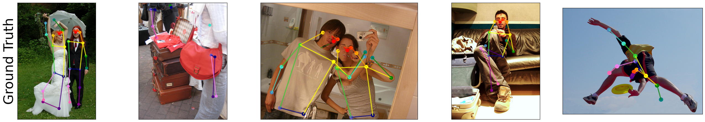
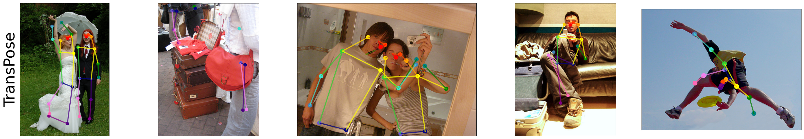
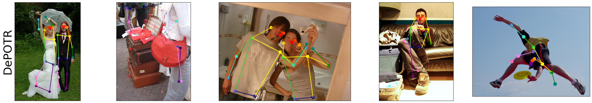

# Thesis Images
In  `scripts` directory are codes used to generate images used in thesis. All necessary data for generating images except coco dataset data are in `scripts --> data --> input` directory or can be downloaded from [GoogleDrive](https://drive.google.com/drive/folders/10lY9VBCKcR3Qwk1mnDBke4qmT97-agjw?usp=sharing).

# Results
Results of trained models compared with [SimpleBaseline](https://github.com/microsoft/human-pose-estimation.pytorch) and [TransPose](https://github.com/yangsenius/TransPose).

| **Method**     | **Backbone** | **Image size**    | **AP**         | **AP50** | **AP75**       | **APM**        | **APL**        | **AR**         | **AR50**       | **AR75**       | **ARM**        | **ARL**        |
|----------------|--------------|-------------------|----------------|---------------------|----------------|----------------|----------------|----------------|----------------|----------------|----------------|----------------|
| SimpleBaseline | ResNet50     | 384 × 288         | 71.5           | 91.1                | 78.7           | 67.8           | 78.0           | 76.9           | **94.6**       | 83.5           | 72.3           | **83.2**       |
| TransPose      | ResNet50     | 256 × 192         | **72.1**       | **91.3**            | **79.9**       | **68.5**       | **78.2**       | **77.3**       | **94.6**       | **84.3**       | **73.0**       | **83.2**       |
| DePOTR         | ResNet50     | 256 × 192         | 55.7           | 83.8                | 61.4           | 54.1           | 60.5           | 66.5           | 90.2           | 72.8           | 62.8           | 71.6           |
| DePOTR-HM      | ResNet50     | 384 × 288         | 63.4           | 87.8                | 70.6           | 61.1           | 68.1           | 69.2           | 91.8           | 75.9           | 65.8           | 73.9           |

| **Method**     | **Backbone** | **Image size**    | **AP**         | **AP50** | **AP75**       | **APM**        | **APL**        | **AR**         | **AR50**       | **AR75**       | **ARM**        | **ARL**        |
|----------------|--------------|-------------------|----------------|---------------------|----------------|----------------|----------------|----------------|----------------|----------------|----------------|----------------|
| SimpleBaseline | ResNet152    | 384 × 288      | 73.7         | 91.9                | 81.1           | 70.3           | 80.0            | 79.0           | 95.2           | 85.6           | 74.8           | 84.9           |
| TransPose      | HRNet        | 256 × 192      | **75.0**     | **92.2**            | **82.3**       | **71.3**       | **81.1**        | **80.1**       | **95.4**       | **86.7**       | **75.9**       | **85.9**       |
| DePOTR         | ResNet152    | 256 × 192      | 54.5         | 83.2                | 60.1           | 53.1           | 59.1            | 65.4           | 89.7           | 71.9           | 62.0           | 70.2           |
| DePOTR-HM      | ResNet152    | 384 × 288      | 65.0         | 88.6                | 72.4           | 62.5           | 70.0            | 71.0           | 92.5           | 78.0           | 67.3           | 76.1           |

